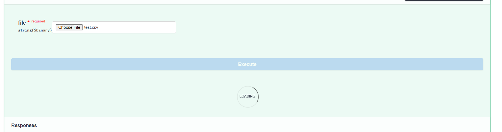

## Запуск

1. Скачайте репозиторий 
```bash
git clone https://github.com/SoberSinceToday/nornikel_hack.git
```

2. Перейдите в папку проекта и скачайте все нужные зависимости:
```bash
cd nornikel_hack
pip install -r requirements.txt
```


3. Далее перейдите в директорию `app` и запустите файл `main.py`:
```bash
cd app
python main.py
```
!Рекомендуемая python версия `3.12.4`. В любом случае вас попросят обновиться до нужной версии

4. После действий проделанных выше, в терминале вы увидите это:
```bash
INFO:     Will watch for changes in these directories: ['C:\\Users\\knyaz_ayotgwn\\nornikel_hack\\app']
INFO:     Uvicorn running on http://127.0.0.1:8000 (Press CTRL+C to quit)
INFO:     Started reloader process [27896] using StatReload
INFO:     Started server process [1692]
INFO:     Waiting for application startup.
INFO:     Application startup complete.
```
Нажмите `Ctrl` + `Click` левой кнопкой мыши по `http://127.0.0.1:8000`

5. Откройте браузер по адресу `127.0.0.1:8000`:


6. Далее прибавьте к ссылке `http://127.0.0.1:8000` + `/docs` чтобы открыть `Swagger UI`:


7. Откройте `POST: /upload_csv/`:
 

8. Нажмите `try it out` -> `choose file` -> `execute`:


9. Ожидайте окончания работы моделей и сервиса:


10. Далее у вас появится кнопка `DOWNLOAD`, нажмите на неё и вы получите предсказания модели:


!Время выполнения кода может быть довольно большим, это зависит от количество итераций, которое вы можете изменить в файле `utils.py` в переменной `ITERS` чем меньше итераций, тем быстрее отработает сервис, но тем менее точнее будет делать предсказания.


## API документаци


-